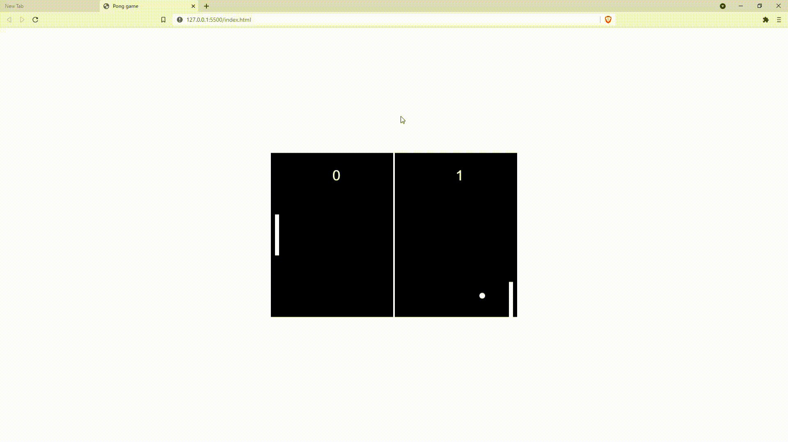

<div id="top"></div>
<!--
*** Amazing README template from othneildrew
*** https://github.com/othneildrew/Best-README-Template
-->


<!-- PROJECT LOGO -->
<br />
<div align="center">
  <h1>Pong Clone in ts and html5</h1>
</div>

<!-- ABOUT THE PROJECT -->
## ℹ️ About The Project



Practicing ts making a PONG clone, this code will come in handy for our next project, _ft_transcendece_.

<p align="right">(<a href="#top">back to top</a>)</p>


<!-- GETTING STARTED -->
## 🏃 Quick Start

### Installation

* Clone the repo
  ```sh
  git clone https://github.com/its-a-maxi/Making-Pong-in-TS.git
  ```
  
<p align="right">(<a href="#top">back to top</a>)</p>


<!-- USAGE EXAMPLES -->
## ⌨️ Usage

* Open index.html in your preferred browser

<p align="right">(<a href="#top">back to top</a>)</p>


<!-- CONTACT -->
## 📫 Contact

Maximo Monroy - monroy.vds@gmail.com

Project Link: [https://github.com/its-a-maxi/Making-Pong-in-TS](https://github.com/its-a-maxi/Making-Pong-in-TS)

<p align="right">(<a href="#top">back to top</a>)</p>


<!-- ACKNOWLEDGMENTS -->
## 🥇 Acknowledgments

Project made following _thecodingpie_ tutorial and adapting it to typescript.
* [Learn to Code Ping Pong Game](https://thecodingpie.com/post/learn-to-code-ping-pong-game-using-javascript-and-html5)

<p align="right">(<a href="#top">back to top</a>)</p>


<!-- MARKDOWN LINKS & IMAGES -->
<!-- https://www.markdownguide.org/basic-syntax/#reference-style-links -->
[contributors-shield]: https://img.shields.io/github/contributors/othneildrew/Best-README-Template.svg?style=for-the-badge
[contributors-url]: https://github.com/othneildrew/Best-README-Template/graphs/contributors
[forks-shield]: https://img.shields.io/github/forks/othneildrew/Best-README-Template.svg?style=for-the-badge
[forks-url]: https://github.com/othneildrew/Best-README-Template/network/members
[stars-shield]: https://img.shields.io/github/stars/othneildrew/Best-README-Template.svg?style=for-the-badge
[stars-url]: https://github.com/othneildrew/Best-README-Template/stargazers
[issues-shield]: https://img.shields.io/github/issues/othneildrew/Best-README-Template.svg?style=for-the-badge
[issues-url]: https://github.com/othneildrew/Best-README-Template/issues
[license-shield]: https://img.shields.io/github/license/othneildrew/Best-README-Template.svg?style=for-the-badge
[license-url]: https://github.com/othneildrew/Best-README-Template/blob/master/LICENSE.txt
[linkedin-shield]: https://img.shields.io/badge/-LinkedIn-black.svg?style=for-the-badge&logo=linkedin&colorB=555
[linkedin-url]: https://linkedin.com/in/othneildrew
[product-screenshot]: images/screenshot.png
